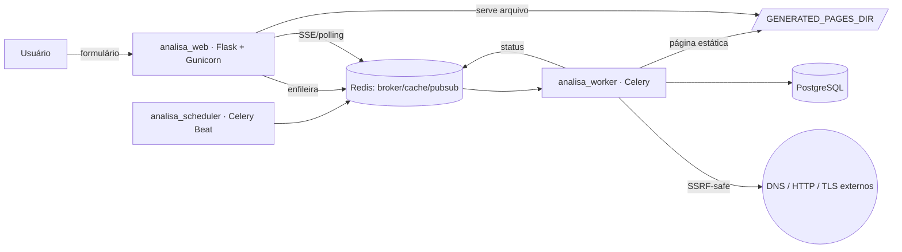

# Arquitetura

## Visão geral

Sem Nginx nesta fase: o próprio Gunicorn serve rotas dinâmicas, assets
buildados e páginas estáticas geradas (`app/blueprints/public_pages.py`
tenta o arquivo em disco antes de renderizar dinamicamente).

## Modelo de dados

Sete entidades principais (`app/models/`):

| Tabela | Papel |
|---|---|
| `tool_categories` | Metadados de categoria, sincronizados do código |
| `tools` | Espelha o registro de código; guarda toggles administráveis |
| `searches` | Uma linha por consulta, com `public_id` aleatório e `dedupe_key` |
| `search_results` | Resultado normalizado (JSONB) + bruto + resumo |
| `generated_pages` | Página estática pública, com `index_status` |
| `job_events` | Histórico de status de cada consulta (para a barra de progresso) |
| `abuse_events` | Rate limit excedido, CAPTCHA falho, bloqueio de SSRF |

`ip_hash`/`user_agent_hash` usam HMAC-SHA256 com salt rotativo
(`IP_HASH_SALTS`) — o IP nunca é persistido em texto puro.

## Ciclo de vida de uma consulta

1. **Validação e antiabuso** (`app/blueprints/main/routes.py`): CAPTCHA,
   rate limiting em várias camadas (`app/security/rate_limit.py`), checagem
   de bloqueio por hash (`app/security/blocklist.py`).
2. **Deduplicação** (`SearchService.submit`): calcula `dedupe_key` =
   `sha256(tool_slug + normalized_input + analyzer_version)`. Se existir uma
   busca `completed` dentro do TTL da ferramenta, reaproveita o resultado
   (sem reprocessar) e só registra métricas.
3. **Enfileiramento e redirecionamento**: cria `Search` (`status=queued`),
   chama `celery_app.send_task` (decoplado por nome de task,
   `app/tasks/task_names.py`, para não criar import circular entre
   `services/` e `tasks/`) e redireciona o navegador imediatamente para a
   **URL canônica e legível** do resultado (`/<prefix>/<slug>/`, ex.:
   `/dns/exemplo.com/`) — nunca para uma URL baseada no `public_id`
   aleatório. Essa mesma URL serve tanto a barra de status enquanto a
   consulta está pendente quanto o resultado final assim que fica pronto:
   `app/blueprints/public_pages.py::public_result_page` decide o que
   renderizar, primeiro tentando a página estática já gerada e, na
   ausência dela, localizando a `Search` mais recente cujo
   `tool.public_slug(normalized_input)` bate com o slug da URL.
4. **Execução** (`app/tasks/search_tasks.py`): `tool.execute()` roda dentro
   da task, protegido por `SafeHTTPClient`/`resolve_host_ips`
   (`app/security/ssrf.py`). Timeout, backoff exponencial e limite de
   tentativas só se aplicam a falhas transitórias de rede — falhas
   definitivas (bloqueio SSRF, resposta grande demais) marcam `failed` na
   hora.
5. **Status em tempo real**: cada mudança grava um `JobEvent` e publica em
   Redis pubsub (`job:<public_id>`); `app/blueprints/live.py` expõe isso via
   SSE (com snapshot em Redis para quem conecta depois do evento, e fallback
   para polling no client — `app/static/src/js/components/job-status.js`).
   Não é uma API pública do produto, apenas um endpoint interno que a própria
   página consulta para atualizar a barra de status.
6. **Página pública** (`app/services/page_generation.py`): se a ferramenta é
   indexável, uma segunda task renderiza o mesmo template Jinja da
   ferramenta em `mode="result"`, decide `index`/`noindex`
   (`PageIndexabilityService`) e grava o HTML em
   `GENERATED_PAGES_DIR/<tool>/<slug>/index.html`.
7. **Sitemaps** (`app/services/sitemap_service.py`): Celery Beat regenera
   periodicamente sitemaps segmentados (estático, categorias, ferramentas,
   páginas paginadas por `SITEMAP_MAX_URLS_PER_FILE`), incluindo só páginas
   com `index_status=index`.

## Padrão de ferramenta

Cada ferramenta é uma subclasse de `BaseTool`
(`app/tools/base.py`) com:

- `validate_input(raw) -> cleaned` — levanta `ToolValidationError`.
- `normalize_input(cleaned) -> str` — usado para dedupe e slug da URL.
- `execute(normalized) -> ToolResult` — roda na task Celery; `ToolResult.data`
  é o que fica em `search_results.normalized_result` (JSONB) e é o que o
  template da ferramenta renderiza.
- `seo_metadata`, `is_indexable`, `public_slug` — controlam a página pública.

O template (`app/templates/tools/<slug>.html`) é **próprio de cada
ferramenta** — não há um template genérico compartilhado. Macros reutilizáveis
(breadcrumbs, captcha, barra de status, FAQ, JSON-LD) ficam em
`app/templates/tools/_tool_macros.html`, mas a composição/ordem é livre por
ferramenta. Um teste (`tests/test_tool_pages.py`) garante que cada ferramenta
registrada tem um template dedicado com pelo menos 500 palavras de conteúdo
autoral.

Veja [`adding-a-tool.md`](adding-a-tool.md) para o passo a passo de como
adicionar uma nova ferramenta.

## Segurança

Ver [`SECURITY.md`](../SECURITY.md) na raiz do repositório.
