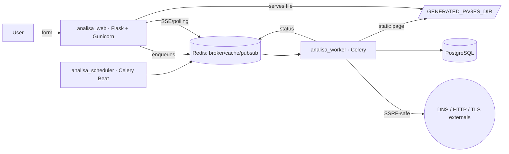

# Architecture

## Overview

No Nginx in this phase: Gunicorn itself serves dynamic routes, built
assets, and generated static pages (`app/blueprints/public_pages.py`
tries the file on disk before rendering dynamically).

## Data model

Seven main entities (`app/models/`):

| Table | Role |
|---|---|
| `tool_categories` | Category metadata, synced from code |
| `tools` | Mirrors the code registry; stores administratable toggles |
| `searches` | One row per query, with random `public_id` and `dedupe_key` |
| `search_results` | Normalized result (JSONB) + raw + summary |
| `generated_pages` | Public static page, with `index_status` |
| `job_events` | Status history for each query (for the progress bar) |
| `abuse_events` | Rate limit exceeded, CAPTCHA failed, SSRF blocked |

`ip_hash`/`user_agent_hash` use HMAC-SHA256 with rotating salt
(`IP_HASH_SALTS`) — the IP is never persisted in plaintext.

## Query lifecycle

1. **Validation and anti-abuse** (`app/blueprints/main/routes.py`): CAPTCHA,
   rate limiting in multiple layers (`app/security/rate_limit.py`), hash-based
   blocklist check (`app/security/blocklist.py`).
2. **Deduplication** (`SearchService.submit`): calculates `dedupe_key` =
   `sha256(tool_slug + normalized_input + analyzer_version)`. If a
   `completed` search exists within the tool's TTL, the result is reused
   (without reprocessing) and only metrics are recorded.
3. **Enqueueing and redirecting**: creates a `Search` (`status=queued`),
   calls `celery_app.send_task` (decoupled by task name,
   `app/tasks/task_names.py`, to avoid circular imports between
   `services/` and `tasks/`) and immediately redirects the browser to the
   **canonical, readable** result URL (`/<prefix>/<slug>/`, e.g.,
   `/dns/example.com/`) — never to a URL based on the random `public_id`.
   This same URL serves both the status bar while the query is pending and
   the final result once ready: `app/blueprints/public_pages.py::public_result_page`
   decides what to render, first trying the already-generated static page and,
   in its absence, locating the most recent `Search` whose
   `tool.public_slug(normalized_input)` matches the URL slug.
4. **Execution** (`app/tasks/search_tasks.py`): `tool.execute()` runs inside
   the task, protected by `SafeHTTPClient`/`resolve_host_ips`
   (`app/security/ssrf.py`). Timeout, exponential backoff, and attempt limit
   only apply to transient network failures — definitive failures (SSRF block,
   response too large) mark `failed` immediately.
5. **Real-time status**: each change writes a `JobEvent` and publishes to
   Redis pubsub (`job:<public_id>`); `app/blueprints/live.py` exposes this via
   SSE (with a Redis snapshot for those who connect after the event, and fallback
   to polling on the client — `app/static/src/js/components/job-status.js`).
   This is not a public product API, just an internal endpoint that the page
   itself queries to update the status bar.
6. **Public page** (`app/services/page_generation.py`): if the tool is indexable,
   a second task renders the same Jinja template the tool uses in
   `mode="result"`, decides `index`/`noindex`
   (`PageIndexabilityService`) and writes the HTML to
   `GENERATED_PAGES_DIR/<tool>/<slug>/index.html`.
7. **Sitemaps** (`app/services/sitemap_service.py`): Celery Beat periodically
   regenerates segmented sitemaps (static, categories, tools,
   paginated pages by `SITEMAP_MAX_URLS_PER_FILE`), including only pages
   with `index_status=index`.

## Tool pattern

Each tool is a subclass of `BaseTool`
(`app/tools/base.py`) with:

- `validate_input(raw) -> cleaned` — raises `ToolValidationError`.
- `normalize_input(cleaned) -> str` — used for dedupe and URL slug.
- `execute(normalized) -> ToolResult` — runs in the Celery task; `ToolResult.data`
  is what ends up in `search_results.normalized_result` (JSONB) and is what the
  tool template renders.
- `seo_metadata`, `is_indexable`, `public_slug` — control the public page.

The template (`app/templates/tools/<slug>.html`) is **specific to each
tool** — there is no shared generic template. Reusable macros
(breadcrumbs, captcha, status bar, FAQ, JSON-LD) live in
`app/templates/tools/_tool_macros.html`, but the composition/order is free per
tool. A test (`tests/test_tool_pages.py`) ensures every registered tool has a
dedicated template with at least 500 words of original content.

See [`adding-a-tool.md`](adding-a-tool.md) for the step-by-step guide to
adding a new tool.

## Security

See [`SECURITY.md`](../SECURITY.md) at the repository root.